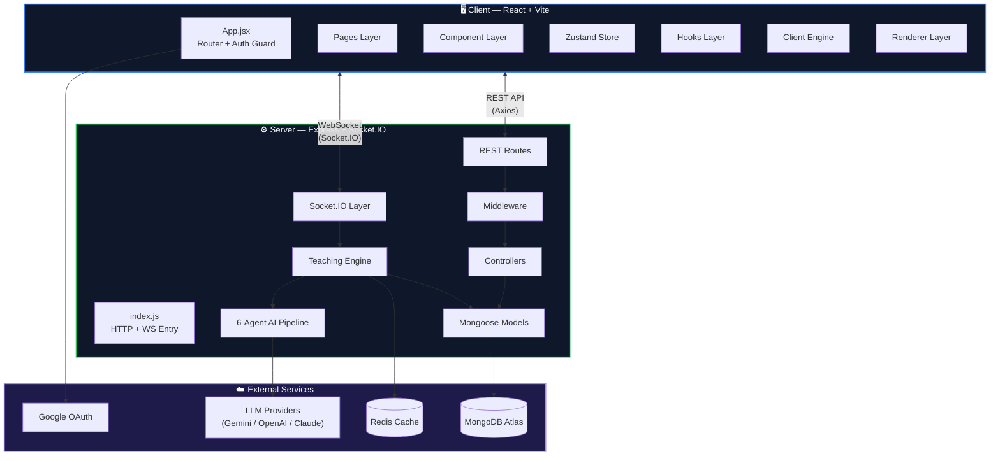
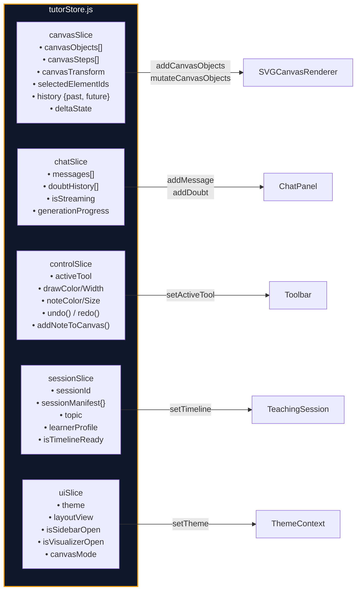
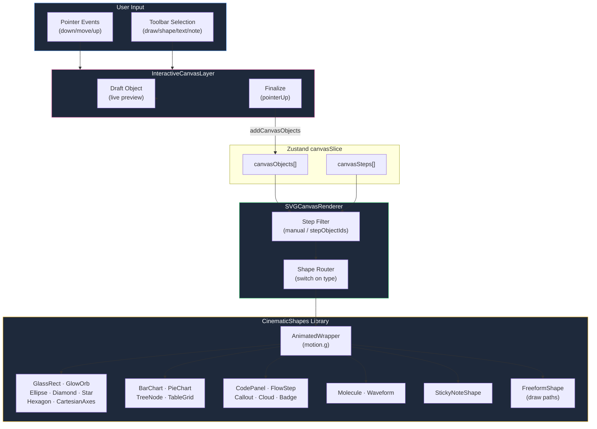
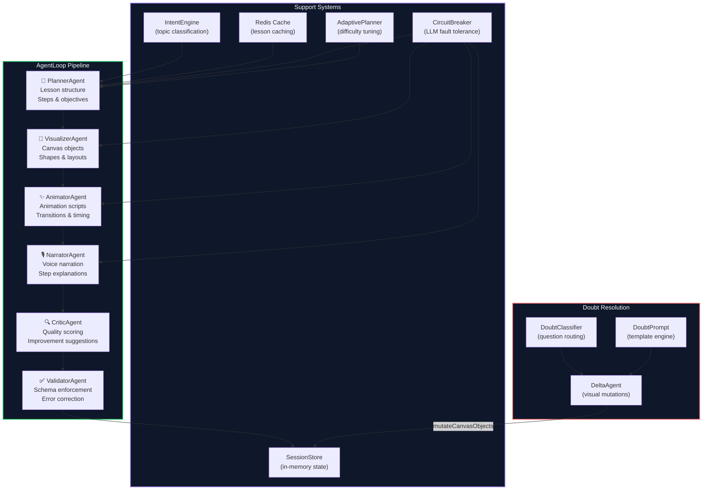
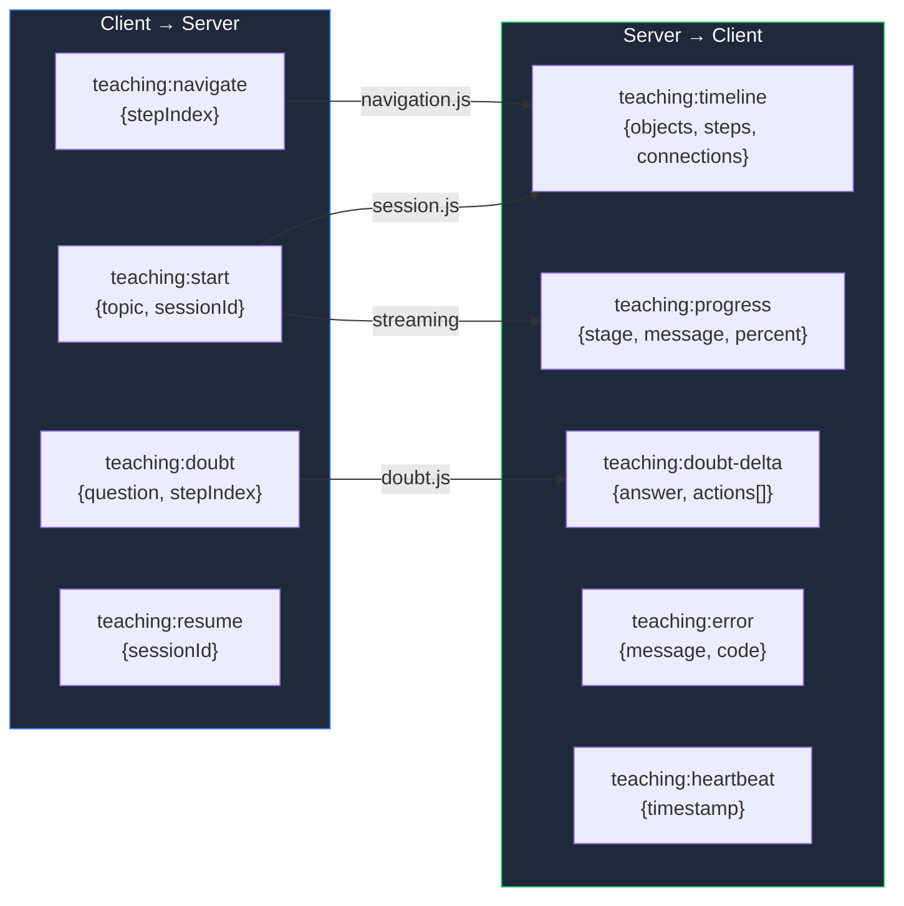
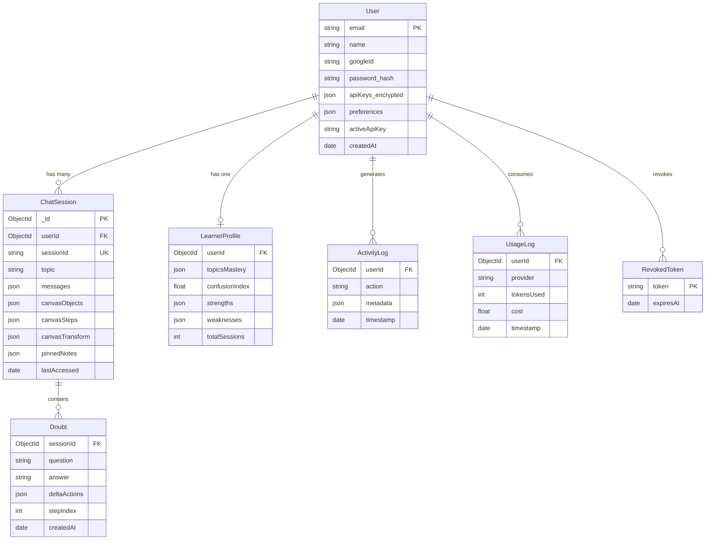
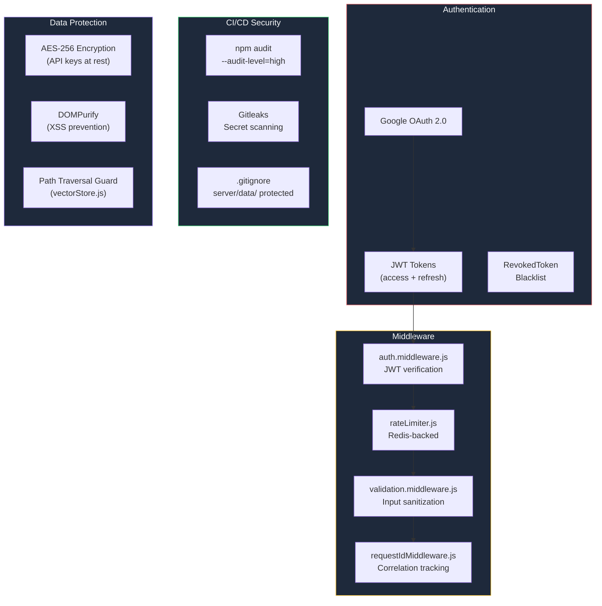

# 🧠 TutorBoard — Full Architecture Graph

> AI-powered interactive teaching platform with real-time canvas rendering, multi-agent lesson generation, and adaptive learning.

---

## 🏗️ System Overview



---

## 📂 File Tree (Annotated)

```
TutorBoard/
├── .github/workflows/
│   └── ci.yml                    # CI/CD: tests, npm audit, gitleaks
├── .infrastructure/
│   └── cloudflare.md             # CDN config documentation
│
├── client/                       # ══════ FRONTEND ══════
│   └── src/
│       ├── main.jsx              # Vite entry, providers
│       ├── App.jsx               # Router, auth guard, theme
│       ├── index.css             # Design system tokens
│       │
│       ├── pages/
│       │   ├── Home.jsx          # Main workspace (49KB)
│       │   ├── AuthLanding.jsx   # Login / signup
│       │   └── Settings.jsx      # Modular settings shell
│       │
│       ├── context/
│       │   ├── AuthContext.jsx   # Google OAuth + JWT
│       │   └── ThemeContext.jsx  # Dark/Light system
│       │
│       ├── store/
│       │   ├── tutorStore.js     # Zustand root (5 slices)
│       │   └── slices/
│       │       ├── canvasSlice   # Canvas objects, steps, transform
│       │       ├── chatSlice     # Messages, doubts, delta state
│       │       ├── controlSlice  # Playback, notes, undo/redo
│       │       ├── sessionSlice  # Session lifecycle, sync
│       │       └── uiSlice      # Theme, layout, preferences
│       │
│       ├── hooks/
│       │   ├── useTeachingMachine.js  # Socket event orchestrator
│       │   ├── useSocket.js           # Socket.IO connection
│       │   ├── useSessionSync.js      # MongoDB auto-sync
│       │   └── useClickOutside.js     # UI utility
│       │
│       ├── engine/
│       │   ├── VisualScriptInterpreter.jsx  # GSAP animation driver
│       │   ├── GSAPExecutor.js              # Tween execution
│       │   ├── RendererRouter.js            # SVG/D3/Matter picker
│       │   └── CanvasStateSnapshot.js       # State serialization
│       │
│       ├── components/
│       │   ├── canvas/           # ── Drawing Engine ──
│       │   │   ├── InfiniteCanvas.jsx        # Pan/Zoom viewport
│       │   │   ├── InteractiveCanvasLayer    # Pointer → shapes
│       │   │   ├── SVGCanvasRenderer.jsx     # Object → SVG
│       │   │   ├── AgentCanvasRenderer.jsx   # AI element router
│       │   │   ├── InlineEditor.jsx          # Rich text editing
│       │   │   ├── FloatingFormatBar.jsx     # Selection toolbar
│       │   │   ├── CodeVisualizerModal.jsx   # Code runner
│       │   │   └── CanvasMinimap.jsx         # Navigation minimap
│       │   │
│       │   ├── teaching/         # ── Lesson UI ──
│       │   │   ├── TeachingSession.jsx   # Session orchestrator
│       │   │   ├── StepPanel.jsx         # Step content renderer
│       │   │   ├── StepFilmstrip.jsx     # Timeline navigation
│       │   │   ├── NarrationBar.jsx      # Voice narration bar
│       │   │   ├── DoubtPanel.jsx        # Question submission
│       │   │   ├── DoubtThread.jsx       # Conversation history
│       │   │   ├── MasteryHUD.jsx        # Progress analytics
│       │   │   ├── SessionOverlay.jsx    # Generation progress
│       │   │   ├── ShortcutsHUD.jsx      # Keyboard shortcuts
│       │   │   └── QuizRenderer.jsx      # Checkpoint quizzes
│       │   │
│       │   ├── toolbar/          # ── Tool System ──
│       │   │   ├── Toolbar.jsx           # Layout + shortcuts
│       │   │   ├── tools/
│       │   │   │   ├── ToolButtonBase    # Shared button logic
│       │   │   │   ├── DrawTool          # Pen/Marker/Laser/Eraser
│       │   │   │   ├── ShapeTool         # 10 geometric primitives
│       │   │   │   ├── TextTool          # Heading/Body/Caption
│       │   │   │   ├── NoteTool          # Sticky notes
│       │   │   │   └── VisualizerTool    # Code visualizer
│       │   │   └── actions/
│       │   │       ├── ShareAction       # Export / share
│       │   │       └── DeleteAction      # Clear canvas
│       │   │
│       │   └── renderers/        # ── Shape Library ──
│       │       ├── CinematicShapes.jsx   # Re-export barrel
│       │       ├── shapes/
│       │       │   ├── AnimatedWrapper   # Motion.g + selection
│       │       │   ├── BaseShapes        # Rect, Ellipse, Diamond...
│       │       │   ├── DataShapes        # BarChart, PieChart...
│       │       │   ├── NotationShapes    # Arrow, Bracket, Brace
│       │       │   ├── PresentationShapes # Code, Badge, Callout
│       │       │   ├── ScientificShapes  # Molecule, Waveform
│       │       │   └── StickyNoteShape   # Editable sticky note
│       │       └── D3Renderer.jsx        # D3.js canvas engine
│       │
│       └── renderers/
│           ├── KaTeXRenderer.jsx     # LaTeX math rendering
│           └── D3Renderer.jsx        # D3 visualization engine
│
├── server/                       # ══════ BACKEND ══════
│   ├── index.js                  # Express + Mongo + Socket.IO
│   │
│   ├── middleware/
│   │   ├── auth.middleware.js    # JWT verification
│   │   ├── rateLimiter.js        # Redis-backed rate limiting
│   │   ├── requestIdMiddleware   # Correlation IDs
│   │   └── validation.middleware # Input sanitization
│   │
│   ├── routes/
│   │   ├── auth.js               # POST /login, /register, /google
│   │   ├── session.js            # GET/POST /sessions
│   │   ├── apikeys.js            # CRUD /apikeys
│   │   ├── doubt.js              # POST /doubts
│   │   ├── generate.js           # POST /generate
│   │   └── user.js               # GET/PUT /user
│   │
│   ├── controllers/
│   │   ├── auth.controller       # OAuth + JWT issuance
│   │   ├── session.controller    # Session CRUD + sync
│   │   ├── apikeys.controller    # Encrypted key management
│   │   ├── doubt.controller      # Doubt persistence
│   │   ├── generate.controller   # Generation trigger
│   │   └── user.controller       # Profile management
│   │
│   ├── models/
│   │   ├── User.js               # Auth + preferences
│   │   ├── ChatSession.js        # Session + canvas state
│   │   ├── LearnerProfile.js     # Mastery + confusion index
│   │   ├── Doubt.js              # Question history
│   │   ├── ActivityLog.js        # Usage analytics
│   │   ├── UsageLog.js           # API consumption
│   │   └── RevokedToken.js       # Token blacklist
│   │
│   ├── sockets/
│   │   ├── teaching.socket.js    # Socket.IO namespace
│   │   ├── utils.js              # Auth + helpers
│   │   └── handlers/
│   │       ├── session.js        # teaching:start → pipeline
│   │       ├── doubt.js          # teaching:doubt → delta
│   │       └── navigation.js     # teaching:nav → step jump
│   │
│   └── engine/
│       ├── core/
│       │   ├── agentLoop.js          # 6-agent orchestrator (19KB)
│       │   ├── pedagogyEngine.js     # Lesson structure gen (20KB)
│       │   ├── teachingMachine.js    # State machine controller
│       │   ├── sessionStore.js       # In-memory session cache
│       │   ├── intentEngine.js       # Topic classification
│       │   ├── cache.js              # Redis + LRU cache
│       │   ├── circuitBreaker.js     # LLM fault tolerance
│       │   ├── adaptivePlanner.js    # Difficulty adaptation
│       │   ├── animationPlanner.js   # Visual script planning
│       │   ├── rendererRouter.js     # SVG/D3/Matter selection
│       │   ├── vectorStore.js        # Semantic memory (stubbed)
│       │   └── visualScriptValidator # Schema validation
│       │
│       ├── agents/
│       │   ├── index.js              # Agent registry
│       │   ├── plannerAgent.js       # Lesson structure
│       │   ├── visualizerAgent.js    # Canvas object generation
│       │   ├── animatorAgent.js      # Animation sequencing
│       │   ├── narratorAgent.js      # Voice narration text
│       │   ├── criticAgent.js        # Quality assurance
│       │   ├── validatorAgent.js     # Schema enforcement
│       │   ├── deltaAgent.js         # Doubt-driven mutations
│       │   ├── doubtClassifier.js    # Question routing
│       │   └── doubtPrompt.js        # Doubt prompt templates
│       │
│       ├── config/
│       │   ├── domainConfig.js       # Subject domain rules
│       │   ├── promptRegistry.js     # System prompt library
│       │   ├── visualScriptTemplates # Template definitions
│       │   └── domains/              # Per-subject configs
│       │
│       ├── tools/                    # Agent tool functions
│       ├── utils/                    # Shared utilities
│       └── validators/               # Input validators
```

---

## 🔄 Data Flow: Student Session Lifecycle

```mermaid
sequenceDiagram
    participant S as Student
    participant UI as React UI
    participant WS as Socket.IO
    participant TM as TeachingMachine
    participant AL as AgentLoop
    participant LLM as LLM Provider
    participant DB as MongoDB

    S->>UI: Types "explain bubble sort"
    UI->>WS: teaching:start {topic}
    WS->>TM: initSession()
    TM->>AL: runPipeline(topic)
    
    rect rgb(30, 41, 59)
        Note over AL: 6-Agent Pipeline
        AL->>LLM: 1. Planner → lesson structure
        LLM-->>AL: {steps, objectives}
        AL->>LLM: 2. Visualizer → canvas objects
        LLM-->>AL: {elements, connections}
        AL->>LLM: 3. Animator → animation scripts
        LLM-->>AL: {animations, transitions}
        AL->>LLM: 4. Narrator → voice text
        LLM-->>AL: {narration per step}
        AL->>LLM: 5. Critic → quality check
        LLM-->>AL: {score, suggestions}
        AL->>LLM: 6. Validator → schema fix
        LLM-->>AL: {validated timeline}
    end

    AL-->>WS: teaching:timeline {objects, steps}
    WS-->>UI: Render on InfiniteCanvas
    UI->>UI: SVGCanvasRenderer + GSAP

    S->>UI: Asks "why does i stop at n-1?"
    UI->>WS: teaching:doubt {question}
    WS->>TM: handleDoubt()
    TM->>LLM: DeltaAgent → visual answer
    LLM-->>TM: {answer, actions[]}
    TM-->>WS: teaching:doubt-delta
    WS-->>UI: mutateCanvasObjects + animate
    
    TM->>DB: persist session + mastery
```



---

## 🧩 Zustand Store Architecture



---

## 🎨 Canvas Rendering Pipeline



---

## ⚙️ Server Engine: 6-Agent Pipeline



---

## 🔌 Socket.IO Event Map



---

## 🗄️ Database Schema Map



---

## 📊 Component Size Heatmap

| Component | Size | Complexity | Role |
|:---|:---:|:---:|:---|
| `Home.jsx` | 49 KB | 🔴 High | Main workspace, session sync, sidebar |
| `CodeVisualizerModal.jsx` | 48 KB | 🔴 High | Interactive code execution |
| `StepPanel.jsx` | 31 KB | 🔴 High | Step content + rich rendering |
| `AuthLanding.jsx` | 31 KB | 🟡 Med | Marketing + auth forms |
| `TeachingSession.jsx` | 30 KB | 🔴 High | Session orchestrator |
| `InlineEditor.jsx` | 27 KB | 🟡 Med | Rich text editing |
| `index.css` | 26 KB | 🟡 Med | Full design system |
| `InfiniteCanvas.jsx` | 23 KB | 🟡 Med | Pan/zoom viewport |
| `useTeachingMachine.js` | 20 KB | 🔴 High | Socket event manager |
| `pedagogyEngine.js` | 20 KB | 🔴 High | Lesson generation core |
| `agentLoop.js` | 19 KB | 🔴 High | 6-agent orchestrator |
| `AuthContext.jsx` | 20 KB | 🟡 Med | OAuth + JWT lifecycle |
| `PremiumTextBox.jsx` | 16 KB | 🟡 Med | Formatted text display |
| `InteractiveCanvasLayer.jsx` | 15 KB | 🟡 Med | Drawing interaction |
| `DrawTool.jsx` | 13 KB | 🟢 Low | Pen/marker/laser UI |
| `ToolButtonBase.jsx` | 13 KB | 🟢 Low | Shared button component |
| `session.js (handler)` | 13 KB | 🟡 Med | Socket session handler |

---

## 🔐 Security Architecture



---

## 📈 Technology Stack

| Layer | Technology | Purpose |
|:---|:---|:---|
| **Frontend** | React 18 + Vite | UI framework + dev server |
| **State** | Zustand (5 slices) | Global state management |
| **Animation** | Framer Motion + GSAP | UI transitions + canvas animations |
| **Canvas** | SVG + D3.js + Matter.js | Rendering engines |
| **Math** | KaTeX | LaTeX equation rendering |
| **Styling** | Vanilla CSS (design tokens) | Theme system |
| **Backend** | Express.js | REST API server |
| **Realtime** | Socket.IO | WebSocket communication |
| **Database** | MongoDB + Mongoose | Persistent storage |
| **Cache** | Redis | Session cache + rate limiting |
| **Auth** | JWT + Google OAuth | Authentication |
| **AI** | Gemini / OpenAI / Claude | Multi-provider LLM |
| **Security** | DOMPurify + AES-256 | XSS prevention + encryption |
| **CI/CD** | GitHub Actions | Automated testing + security |

---

> **Total Files**: ~120+ source files · **Lines of Code**: ~25,000+ · **Architecture**: Modular monolith with real-time WebSocket layer
